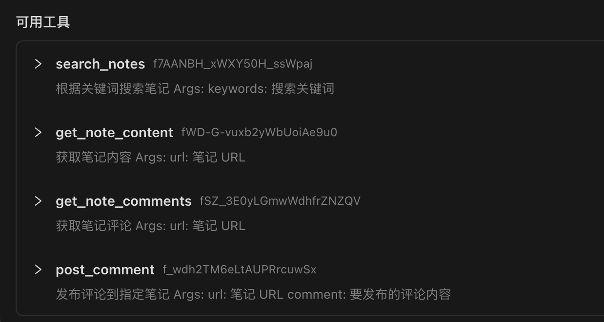
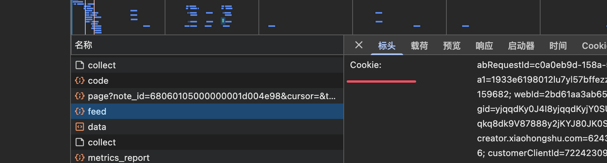

# 小红书MCP服务
## 特点
* 采用js逆向出x-s,x-t,直接请求http接口,无须笨重的playwright
* 搜索笔记
* 获取笔记内容
* 获取笔记的评论
* 发表评论



## 快速开始

### 1. 环境
 * node
 * python >=3.12

### 2. 安装依赖
```sh
 uv sync 
```

### 3. 获取小红书的cookie
    * [打开web小红书](https://www.xiaohongshu.com/explore)
    * 登录后，获取cookie
    

### 4. 配置mcp server

```json
{
    "mcpServers": {
        "xhs-mcp": {
            "command": "/Users/xxx/xhs-mcp/.venv/bin/python",
            "args": [
                "/Users/xxx/xhs-mcp/xhs-mcp/main.py",
                "--stdio"
            ]
        }
    }
}
```

## 免责声明
本项目仅用于学习交流，禁止用于其他用途，任何涉及商业盈利目的均不得使用，否则风险自负。
